<div align="center">
  
</div>

<div align="center">

# CyberSec HUD Clock 

**Uma reimaginação do conceito original, focada em animações cinematográficas de 60 FPS e uma estética de HUD (Heads-Up Display) aprimorada.**

</div>

<div align="center">
  <!-- Badges -->
  <a href="https://github.com/klimadev/clock/blob/main/LICENSE">
    
  </a>
  <a href="https://github.com/klimadev/clock/commits/main">
    
  </a>
</div>

---

## 🙏 Agradecimentos e Origem do Projeto

Este projeto é um fork e uma reimaginação do excelente [CyberSec Clock](https://github.com/JuniorD-Isael/clock) criado por **[JuniorD-Isael](https://github.com/JuniorD-Isael)**. A base sólida que ele criou foi fundamental para a construção das melhorias visuais e de performance aqui presentes.

---

## ✨ Features de Destaque

Este fork eleva a ideia original com uma experiência de usuário totalmente refeita, aplicando princípios de Motion Design para criar uma interface imersiva e responsiva.

| Feature                      | Descrição                                                                                                                |
| ---------------------------- | ------------------------------------------------------------------------------------------------------------------------ |
| 🎬 **Animação de Boot**      | Uma sequência de boot coreografada que revela a interface em cascata, com efeitos de "scramble" e "blur".               |
| ⚙️ **Animação "Tick"**         | Cada segundo não apenas muda, ele "rola" para a posição com uma animação sutil, dando um feedback tátil e contínuo.      |
| 🚀 **Otimizado para 60 FPS** | O código foi refatorado para usar `will-change` e cache de seletores, garantindo animações hiper suaves.                   |
| 🌌 **Fundo de Rede Neural**   | Um fundo dinâmico e animado com partículas que se movem entre nós, adicionando profundidade e vida à cena.             |
| 📅 **Transições de Data**    | A mudança da data à meia-noite é um evento visual, onde a data antiga se desintegra e a nova é revelada.                |

## 💻 Tech Stack

| Tecnologia   | Propósito                                      |
| ------------ | ---------------------------------------------- |
| **HTML5**    | Estrutura semântica da aplicação               |
| **CSS3**     | Estilização avançada e animações de GPU        |
| **JS (ES6+)**| Lógica dinâmica e manipulação do DOM           |
| **GSAP**     | Orquestração de animações complexas e de alta performance |

## 🚀 Como Executar

Para executar este projeto localmente, basta seguir estes passos:

1.  **Clone o repositório:**
    ```bash
    git clone https://github.com/klimadev/clock.git
    ```
2.  **Navegue até o diretório:**
    ```bash
    cd clock
    ```
3.  **Abra o `index.html`:**
    Abra o arquivo `index.html` em qualquer navegador moderno. Não é necessário um servidor local.

## 📜 Licença

Este projeto é distribuído sob a **Licença MIT**, a mesma do projeto original. Veja o arquivo `LICENSE` para mais informações.
